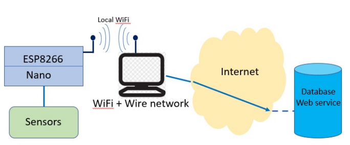
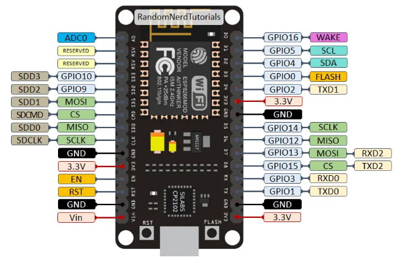
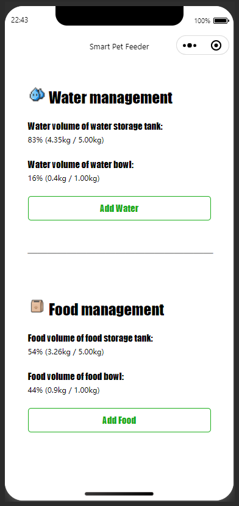

# Smart Pet Feeder

## Introduction

> Use miniprogram to control the feeding and water adding of smart pet feeder through network, monitor the weight of grain storage bin, water storage bin, food bowl and water bowl, and remind users when there is a shortage of water or food.


## Hardware Materials
- **Electronic scale, weight sensor × 1** (3.3V, HX711AD, Digitals)

  

- **IERG4230 half size Main project board × 1**
(6V, with  16-key keypad and LCD display. Nano and
ESP8266 are NOT included)

  
  
- **Arduino Nano × 1**

  
  
- **ESP8266 × 1** (6V, with I/O extended board)

  
  
- **2.4GHz USB WiFi LAN adapter × 1**
- **3V FeLiPO4 re-chargeable battery × 2**
- **Mini-USB cable × 1**
- **Micro-USB cable × 1**
- **Connected board**

  

## Develop Software
- **Arduino IDE 2.0.1**
- **IntelliJ IDEA Community Edition 2022.1**
- **WeChat DevTools 1.06.2210310 Stable**

## Hardware Side

- **Transport Model**



- **ESP8266 Pin Diagram**



## Server Side

#### Environment
  - JDK1.8
  - Spring
  - SpringBoot
  - Maven
  - Lombok
#### Server side interface
 - **Data input interface** ( HttpRequestMethod = GET )
```html
// 传入重量传感器读数
http://192.168.137.1:8088/data/input?weight=999
```
- **Data output interface** ( HttpRequestMethod = GET )
```html
// 获取重量传感器读数
http://192.168.137.1:8088/data/output
```
```html
// 控制硬件端添加水
http://192.168.137.1:8088/add/water
```
```html
// 控制硬件端加粮
http://192.168.137.1:8088/add/food
```


## Miniprogram Side

 

## Note
- **Lab 2.2** 
  - **Set Arduino IDE for ESP8266** （通过URL访问ESP8266服务器）
    - File >> Examples >> ESP8266WebServer >> HelloServer ———— `ESP8266`
- **Lab 2.4**
  - **Run ESP8266 Web client** （通过ESP8266访问内网网页）
    - File >>> Examples >>> ESP8266HTTPClient >>> BasicHttpClient ———— `ESP8266`
- **Lab 2.5** （ESP8266与NANO通信）
  - **Run ESP8266 as an I2C Slave with Nano Master**
    - OS_LED-Exp2.5 ———— `Nano`
    - Exp2.5_given_ESP8266_Slave ———— `ESP8266`

## Reference
- https://zhuanlan.zhihu.com/p/93838734
- https://blog.csdn.net/qq_43701073/article/details/116059977?ops_request_misc=%257B%2522request%255Fid%2522%253A%2522166843153216800182711941%2522%252C%2522scm%2522%253A%252220140713.130102334.pc%255Fall.%2522%257D&request_id=166843153216800182711941&biz_id=0&utm_medium=distribute.pc_search_result.none-task-blog-2~all~first_rank_ecpm_v1~rank_v31_ecpm-8-116059977-null-null.142