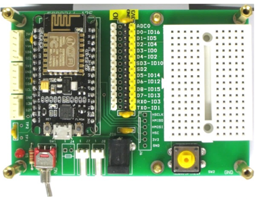

# Smart Pet Feeder

## Hardware Materials
- **Electronic scale, weight sensor * 1** (3.3V, HX711AD, Digitals)

  
- **IERG4230 half size Main project board * 1**
(6V, with  16-key keypad and LCD display. Nano and
ESP8266 are NOT included)

  
- **Arduino Nano * 1**

  
- **ESP8266** (6V, with I/O extended board)

  
- **2.4GHz USB WiFi LAN adapter * 1**
- **3V FeLiPO4 re-chargeable battery * 2**
- **Mini-USB cable * 1**

## Software Environment
- **Arduino IDE 2.0.1**
- 

## Reference
- https://zhuanlan.zhihu.com/p/93838734